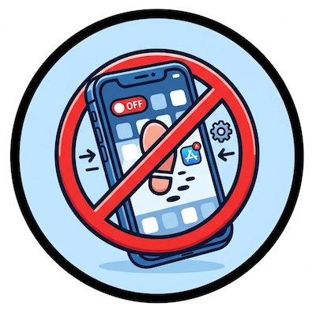
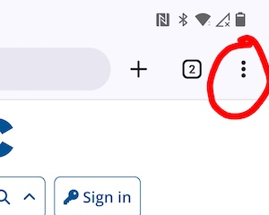
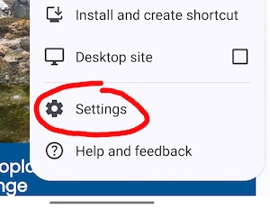
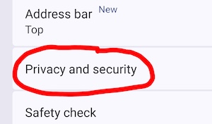
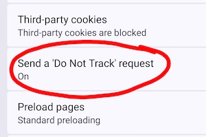
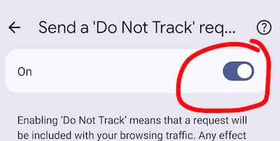

 

# Stop Apps From Tracking You

In this activity, you'll reduce the amount of information that apps can collect about you by disabling cross-app tracking. This helps limit the ability of advertisers to create a detailed advertising profile for you and makes it harder for companies to connect your activity across different apps.

If you have any questions or get stuck, please ask the instructor for assistance.

## Why are we doing this?

Many popular apps collect information about your activity and sell it with advertising networks. This is often how "free" apps pay for their ongoing development. Turning off app tracking reduces this data sharing and helps protect your privacy.

---

iPhone Instructions
{: .label .label-step}
1. Open the **Settings** app.
2. Scroll down and tap **Privacy & Security**. 
    
3. Tap **Tracking**. 
    
4. Toggle off **Allow Apps to Request to Track**. Your screen should look like the image below: 
    
5. This prevents apps from accessing your device's unique Advertising ID (IDFA), making it much more difficult for advertisers to track your activity across different apps and websites.
{: .step}

Android Instructions
{: .label .label-step}
1. Open **Chrome** on your device.
2. To the right of the address bar, tap the main menu button which is **vertical three dots**. 
   
2. Then tap **Settings**. 
   
4. Tap **Privacy and security**. 
   
6. Tap **Send a Do Not Track request**. 
   
8. Turn the setting **On**. 
   
9. This makes it significantly more difficult for advertisers and data brokers to link your activity across different apps.
{: .step}

Reflection
{: .label .label-step}
After completing this activity, consider the following questions:

   - Were you surprised this setting was enabled?
   - How many apps on your phone requested permission to track you?
   - Why might advertisers want to connect your activity across multiple apps?
{: .step}

---

Congratulations! You've taken an important step toward protecting your digital privacy.

[NEXT STEP: Downloading Shielded Browser](2-shielded-browser.html){: .btn .btn-blue }
