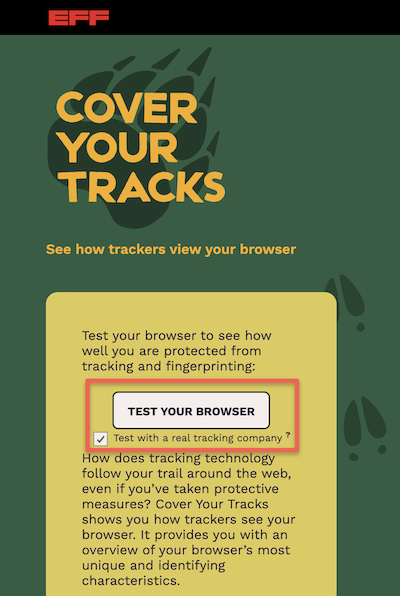

# Evict Yourself from Data Broker Databases
 

Even if you stop tracking today, data brokers already have years of your history. You can force them to delete it.

## The Manual Way 

- Visit the opt-out page for a major data broker, such as [**Acxiom**](https://www.acxiom.com/optout/){:target="_blank"} or [**Epsilon**](https://legal.epsilon.com/optout){:target="_blank"}.
- Follow the instructions to submit an opt-out request.
  
**NOTE:** This is a time-consuming process but it's a great free option

## The Automated Way 

Alternatively, you can use a privacy service such as [**Incogni**](https://incogni.com/){:target="_blank"} or [**DeleteMe**](https://joindeleteme.com/){:target="_blank"} to help automate this process. Both of these services charge start at $20 for one month and over $140 per year for their services.
- These services automatically send legal “Right to Erasure” requests to hundreds of data brokers on your behalf and, critically, keep monitoring to make sure they don’t re-add you later.
- Removing your information from data broker databases reduces the amount of personal information available for advertising, profiling, and identity matching.
- Keep in mind that new information can be collected over time, so you may need to repeat this process periodically.

## Check How "Unique" Your Browser Looks to a Tracker

1. You can visit the EFF's [Cover Your Tracks](https://coveryourtracks.eff.org/){:target="_blank"} tool to find out how unique your browser appears to the websites you visit. 
2. Upon visiting the site, click the **TEST YOUR BROWSER** button.
3. It will then give you a report on how well you're currently protected against fingerprinting. To learn more about browser fingerprinting and browser tracking make sure to click on the green **Learn More** button.

[NEXT STEP: Have You Been Pwned?](5-pwned.html){: .btn .btn-blue }
