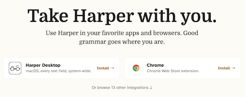
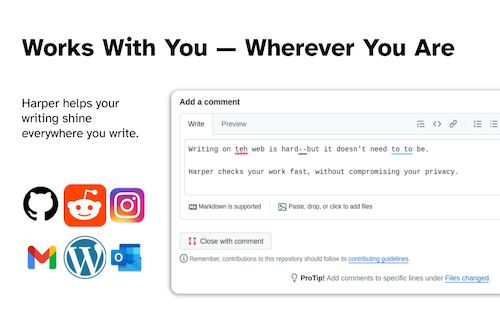

# Activity 7: Try a Privacy-Focused Grammar Checker

Many grammar checkers process your writing using cloud-based services. This means your text may be sent to remote servers for analysis.

Harper is an open-source grammar checker that runs locally on your computer. In this activity, you'll install Harper and try it on a document.

If you have any questions or get stuck, please ask the instructor for assistance.

1. Go to the [**Harper website**](https://writewithharper.com/get){:target="_blank"} download page.
2. Explore the available options for using Harper.
    
3. Install Harper for your browser or computer by following the instructions on the website.
4. Open a document containing some text with a few intentional spelling or grammar mistakes.
5. Use Harper to check your writing.
6. Review the suggestions that Harper provides.
    
7. Try making a few corrections and check the text again.

### Reflection

- Did Harper identify the mistakes you expected it to find?
- Did you notice any differences compared with a grammar checker you have used before?
- Why might someone prefer a grammar checker that runs locally on their computer?
- Can you think of situations where the privacy of a document would be especially important?

Harper can be useful for people who work with sensitive documents because it runs locally rather than requiring the document to be sent to a cloud-based grammar-checking service.
